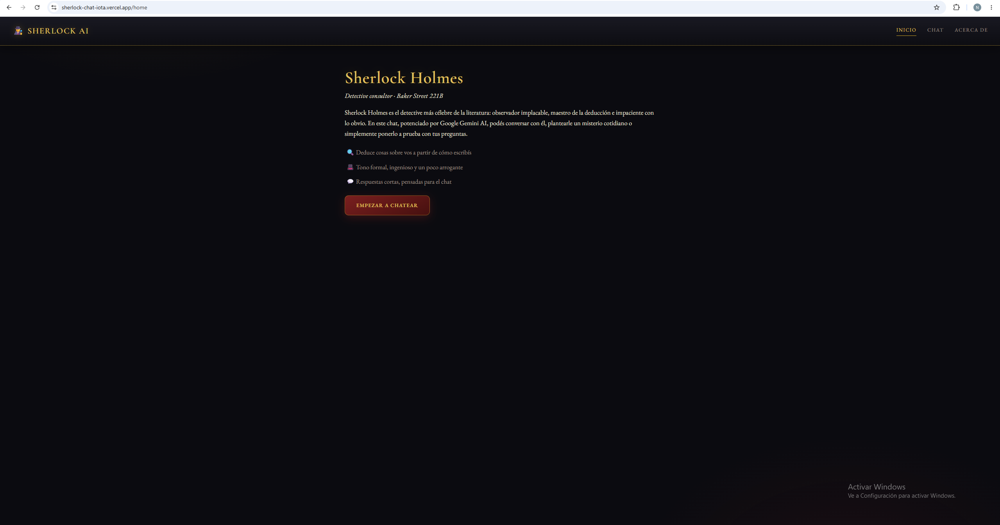
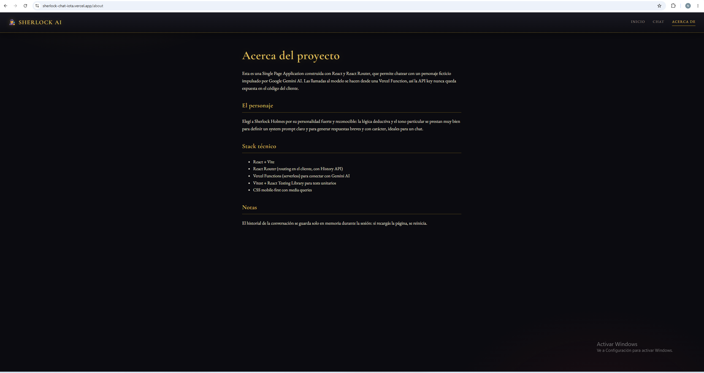
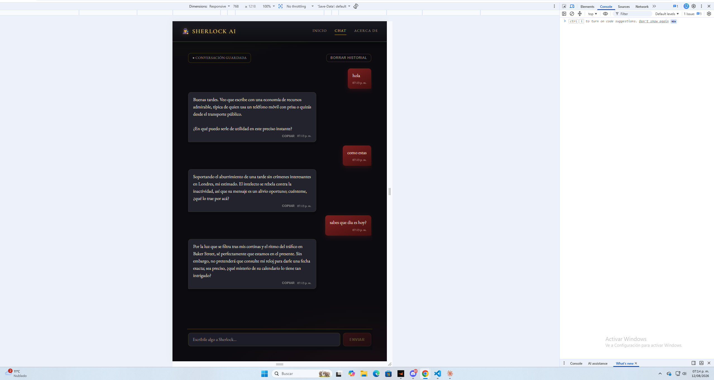
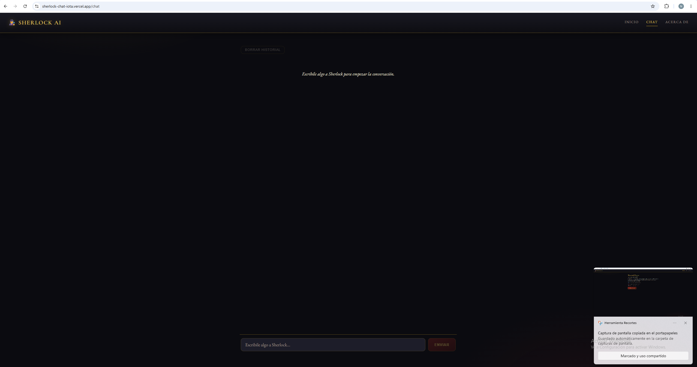

# Chat con Sherlock Holmes 🕵️

Este es mi TP de SPA: una app en React donde podés chatear con Sherlock Holmes,
potenciado por Google Gemini AI. La idea era practicar routing, conexión segura
a una IA externa (sin exponer la key en el cliente) y deploy en Vercel.

Elegí a Sherlock porque tiene una personalidad bien marcada y eso ayuda mucho
a la hora de armar un buen system prompt: deductivo, un poco arrogante, con
tono formal pero con humor.

## El personaje

Sherlock Holmes es el detective consultor de Baker Street 221B, creado por
Arthur Conan Doyle. En este proyecto lo trasladé a la actualidad: sigue
siendo el mismo observador implacable y maestro de la deducción, pero
"vive" en el presente y puede chatear por texto. Sus rasgos principales
en el chat:

- **Deductivo**: hace pequeñas deducciones sobre lo que escribís (tu forma
  de tipear, la hora, el tema que elegís) aunque sean especulativas
- **Formal pero ingenioso**: nunca grosero, pero sí un poco arrogante
- **Impaciente con la vaguedad**: pide precisión si algo es ambiguo
- **Breve**: responde en 1-2 oraciones, como corresponde a un chat real

👉 **Probalo en vivo:** https://sherlock-chat-iota.vercel.app
## Capturas






## Qué tiene

- Rutas: `/home`, `/chat`, `/about` (con React Router, back/forward andan bien)
- Chat con Sherlock: burbujas diferenciadas, "está escribiendo...", manejo de
  errores si falla la API, scroll automático (pero inteligente: si scrolleás
  para arriba a leer algo viejo, no te empuja de nuevo abajo)
- El historial se guarda en el navegador (localStorage), así que si recargás
  la página no perdés la conversación. Hay un botón para borrarlo si querés
  empezar de cero, con confirmación antes de borrar
- Botón para copiar las respuestas de Sherlock
- Enter para enviar, además del botón
- Timestamps en cada mensaje
- Diseño responsive, mobile-first (probado en mobile / tablet / desktop)
- La API key de Gemini nunca toca el navegador: todo pasa por una Vercel
  Function (`api/chat.js`) que corre en el servidor
- 11 tests unitarios con Vitest + Testing Library

## Cómo correrlo en tu máquina

```bash
npm install
cp .env.example .env
```

Completá tu `.env` con tu propia API key de Gemini (ver más abajo cómo
conseguirla).

Para ver solo el diseño de las páginas, alcanza con:

```bash
npm run dev
```

Pero como el chat necesita la función serverless (`/api/chat`), y `vite` solo
no la corre, para probar el chat completo en local hace falta la CLI de
Vercel:

```bash
npm install -g vercel
vercel dev
```

Y ahí sí, `http://localhost:3000/chat` funciona igual que en producción.

## Conseguir tu propia API key de Gemini (gratis)

1. Entrá a https://aistudio.google.com/apikey con tu cuenta de Google
2. "Create API key"
3. Copiá la key y pegala en tu `.env`:
GEMINI_API_KEY=tu_key_aca
GEMINI_MODEL=gemini-3.5-flash
Un par de cosas que aprendí en el camino, por si a alguien más le pasa:
- El nivel gratuito tiene un límite bajo de pedidos por día (20 para este
  modelo). Si ves un error 429 en los logs, es por eso, no es un bug.
- A veces Google devuelve un formato de key distinto al `AIzaSy...` de
  siempre. Si te tira "API key not valid" aunque la key sea correcta, probá
  mandarla como parámetro `?key=` en la URL en vez de como header
  `x-goog-api-key` — a mí me lo solucionó.

## Deploy en Vercel

1. Subí el repo a GitHub
2. En vercel.com, "Add New > Project" y importá el repo (detecta Vite solo)
3. Antes de deployar, cargá las Environment Variables: `GEMINI_API_KEY` y
   `GEMINI_MODEL`
4. Deploy

Si cambiás alguna variable de entorno después, hay que hacer un Redeploy
manual para que el cambio se aplique — no pasa solo.

## Tests

```bash
npm test
```

Corre los tests de componentes, routing y del cliente que llama a
`/api/chat`.

## Stack

React + Vite, React Router, Vercel Functions, Vitest + React Testing
Library, CSS puro (mobile-first, con media queries en 600px y 1024px).

## Uso de IA en este proyecto

Usé Claude (Anthropic) como asistente durante todo el desarrollo, en modo
guiado: yo escribí el código en VS Code, y la IA me fue explicando paso a
paso qué hacer y por qué, sin escribir el código por mí. Concretamente me
ayudó con:

- Explicarme conceptos que no conocía (qué es un commit, qué es la History
  API, por qué usar una Vercel Function en vez de llamar a Gemini directo
  desde el cliente)
- Guiarme en la instalación y configuración del entorno (Node, Git, Vercel
  CLI) y resolver errores puntuales que me fueron apareciendo (permisos de
  PowerShell, scripts bloqueados, etc.)
- Debuggear problemas concretos: un error de autenticación con la API de
  Gemini por un cambio reciente en el formato de las keys de Google, y un
  bug de layout en CSS que hacía que el input del chat quedara fuera de
  pantalla al scrollear
- Redactar el system prompt del personaje y ajustarlo cuando las respuestas
  quedaban muy largas o muy cortas
- Sugerirme mejoras de UX (indicador de "escribiendo...", scroll
  inteligente, persistencia con localStorage) que después implementé

Las decisiones de diseño (qué personaje elegir, qué extras implementar, el
estilo visual "victoriano/noir") fueron mías; la IA me ayudó a ejecutarlas
técnicamente.
### Evidencia adicional

Además de este resumen, dejé documentadas algunas preguntas técnicas
concretas que le hice a la IA sobre el proyecto ya armado (por ejemplo:
por qué fallaba la autenticación con Gemini, qué es el error 429, qué
son los warnings de `npm allow-scripts`, diferencia entre `npm run dev`
y `vercel dev`, entre otras). Las capturas de esas preguntas y respuestas
están en esta carpeta de Drive:

👉 [Ver capturas de uso de IA](https://drive.google.com/drive/folders/1PKg4WsbyeG2wcXUqdOI4TwiesCxa_Sdm?usp=sharing)